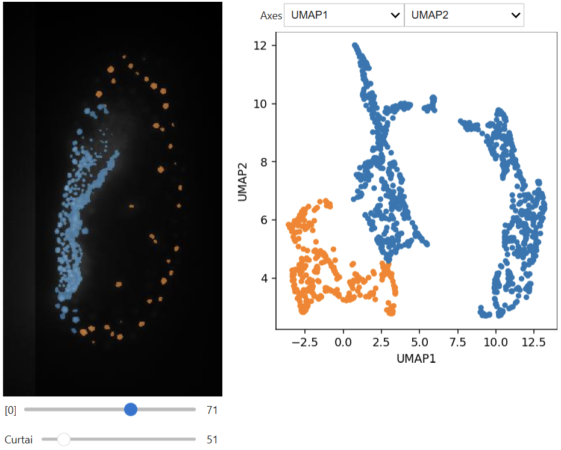
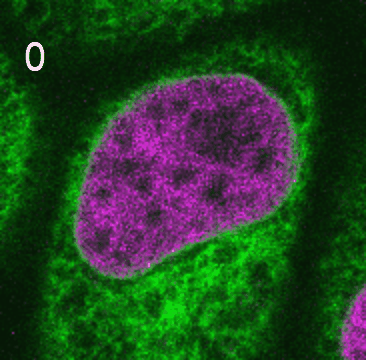

# Further exercises

After learninng how to use `bia-bob` you can move on and apply it to realistic projects. First of all, feel free to use it in projects you brought with you. Alternatively, pick one project from the list below. ALso compare the performance of `bia-bob` with tools such as [ChatGPT](https://chat.openai.com/), [Claude](https://claude.ai/), [Gemini](https://gemini.google.com/), [Cursor](https://cursor.com/) or [Github Copilot](https://github.com/features/copilot).  Goal of this session is to find the limits of the technology and get a glimpse how to identify situations where you can achieve more through more advanced prompting, and situations which simply cannot be solved either by `bia-bob` or even by LLMs in general.

## Interactive analysis

Ask `bia-bob` to segment [data/lund.tif](data/lund.tif) (or load a segmented image), extract shape and intensity features and build a graphical user-interface for exploring measurements in space interactively ([Spoiler](../01_juypter_notebooks/clusterplot.ipynb)).

## Timelapse analysis

Load the dataset [data/timelapse.tif](data/timelapse.tif) (Source: Anrea Boni, EMBL Heidelberg) and measure the intensity in the nuclear envelope over time. ([Spoiler](https://scikit-image.org/docs/stable/auto_examples/applications/plot_fluorescence_nuclear_envelope.html#sphx-glr-auto-examples-applications-plot-fluorescence-nuclear-envelope-py))

## Image stitching

You find two examples images ([data/blobs_stitching1_overlap40.tif](data/blobs_stitching1_overlap40.tif) and [data/blobs_stitching2_overlap40.tif](data/blobs_stitching2_overlap40.tif)) which correspond to two image tiles that were acquired with overlap. Write code for stitching these two images.

## Nextflow

Your starting point is a [jupyter notebook](../01_juypter_notebooks/03_image_processing.ipynb) that analyses some data. Use `bia-bob` to convert it into a nextflow workflow.

## Generating training materials

Generate notebooks for beginners explaning how python libraries work, for example:
* [zarr](https://zarr.dev/)
* [BIP](https://bayesian-inference.readthedocs.io/en/latest/)
* [laptrack](https://github.com/yfukai/laptrack)
* [OpenCV](https://pypi.org/project/opencv-python/)
* [polars](https://pola.rs/)
* [pyclesperanto](https://github.com/clEsperanto/pyclesperanto)
* [Squidpy](https://squidpy.readthedocs.io/en/stable/)
* [multiview-stitcher](https://github.com/multiview-stitcher/multiview-stitcher)
