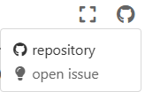
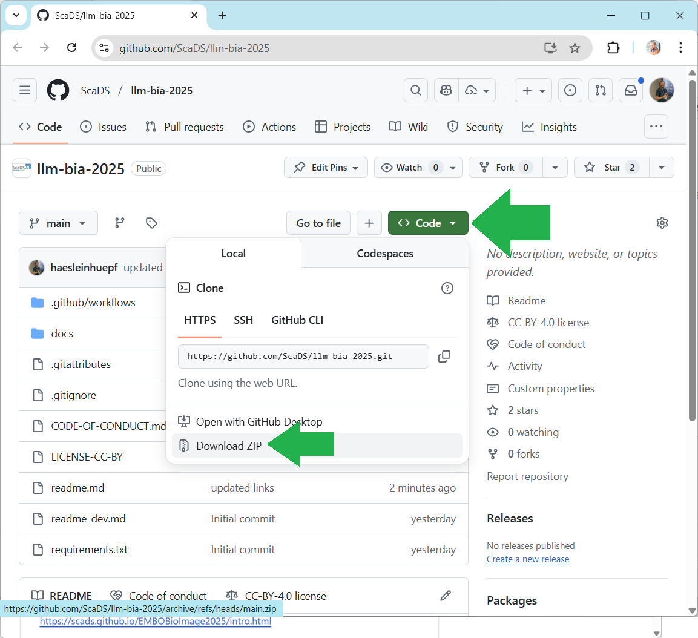
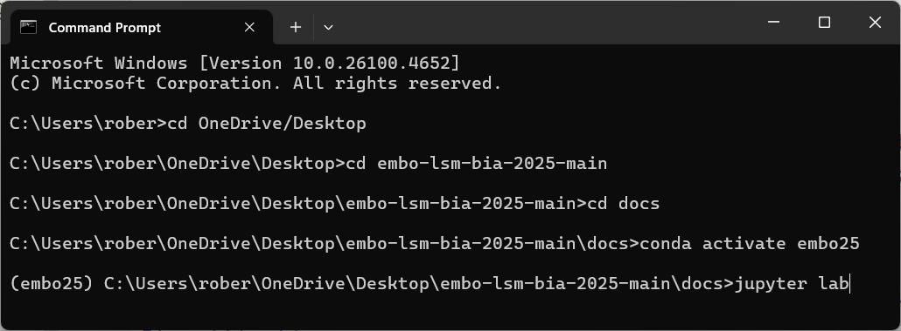
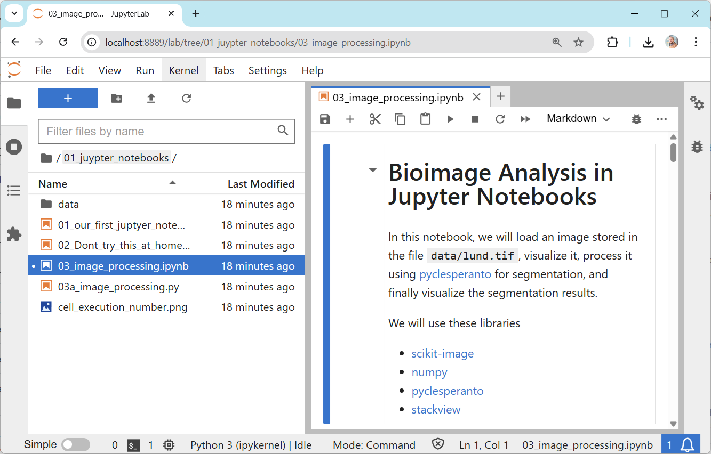

# Large Language Models for BioImage Analysis

This page contains training materials for using Large Language Models for BioImage Analysis.

## Target audience

The notebooks are written for life scientists with basic experience in Python programming. As we have only limited time during the hands-on tutorial, it is recommended that everyone picks some exercises according to their skill-level and needs.

## How to use these materials

On the top of the window, you find a Github-Button, which you can use to navigate the repository of the training materials. 



Download the entire repository as ZIP and unzip the files in a place where you can find them. E.g. on your Desktop.



After the ZIP has been unpacked, navigate to the `docs` folder of the repository using the terminal. E.g. if you downloaded and unpacked the ZIP file on your Desktop, you can do this like this:

```
cd Desktop
```
or (if you use OneDrive to sync your Desktop)
```
cd OneDrive/Desktop
```

```
cd EMBOBioImage2025-main
```
```
cd docs
```
After arriving in this folder, activate your conda environment (if not installed yet, check the [installation instructions](00_setup/readme.md)):
```
conda activate embo25
```
```
jupyter lab
```



After executing this, you can start Jupyter Lab. On the left side you find folders with exercise notebooks and on the right side you find the notebooks to work on.



## Covered topics

* Getting started with Jupyter notebooks
* Image processing and visualization in Jupyter
* Using artificial intelligence to generate image-analysis Python code

## Covered Python libraries

* [bia-bob](https://github.com/haesleinhuepf/bia-bob): AI-assisted BioImage Analysis Code Generation
* [devbio-napari](https://github.com/haesleinhuepf/devbio-napari): A collection of Napari-Plugins for Developmental Biologists
* [numpy](https://numpy.org/): Basic numeric Processing
* [napari](https://napari.org): An interactive nD image viewer
* [napari-assistant](https://github.com/haesleinhuepf/napari-assistant): A pocket-calculator like user interface to build image processing workflows
* [pyclesperanto](https://github.com/clesperanto/pyclesperanto): GPU-accelerated image processing
* [scikit-image](https://scikit-image.org/): Scientific Image Processing
* [stackview](https://github.com/haesleinhuepf/stackview): An interactive nD image viewer for Jupyter Notebooks

## Related materials

If you want to learn more about the topics, these materials shall be recommended:
* [Introduction to BioImage Analysis by Pete Bankhead et al.](https://bioimagebook.github.io/index.html)
* [BioImage Analysis Notebooks by Robert Haase et al.](https://haesleinhuepf.github.io/BioImageAnalysisNotebooks/intro.html)

## Acknowledgements 

We acknowledge the financial support by the Federal Ministry of Education and Research of Germany and by Sächsische Staatsministerium für Wissenschaft, Kultur und Tourismus in the programme Center of Excellence for AI-research „Center for Scalable Data Analytics and Artificial Intelligence Dresden/Leipzig“, project identification number: ScaDS.AI
